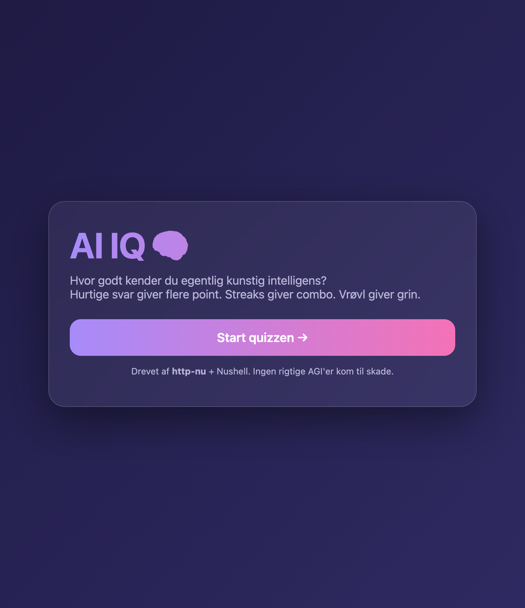
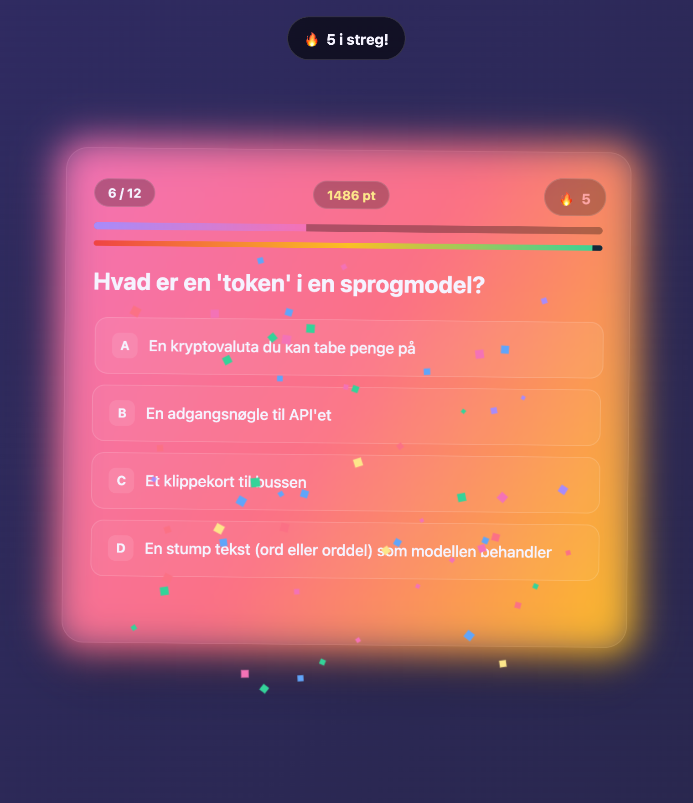
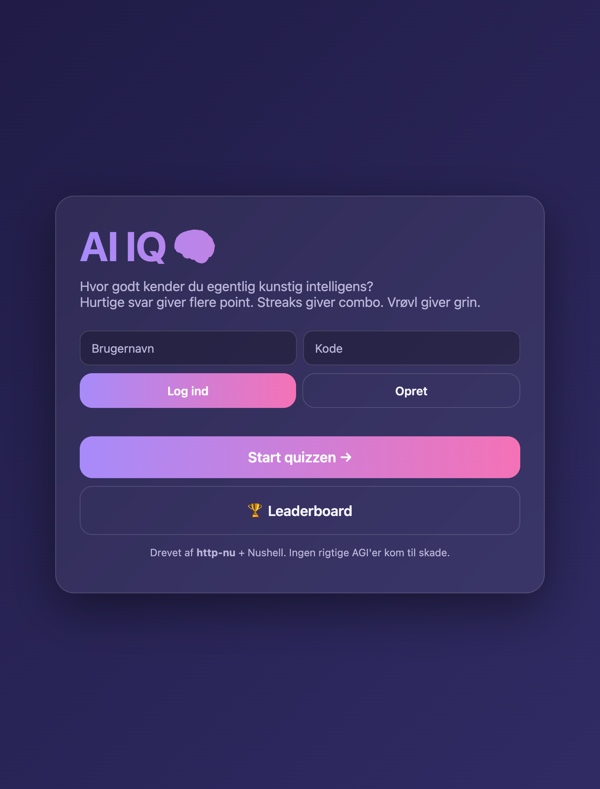
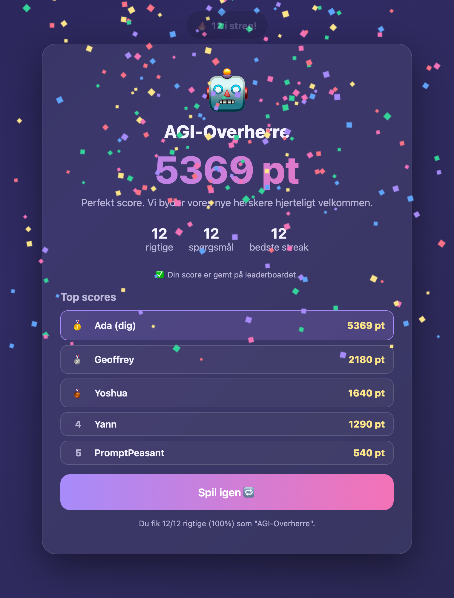
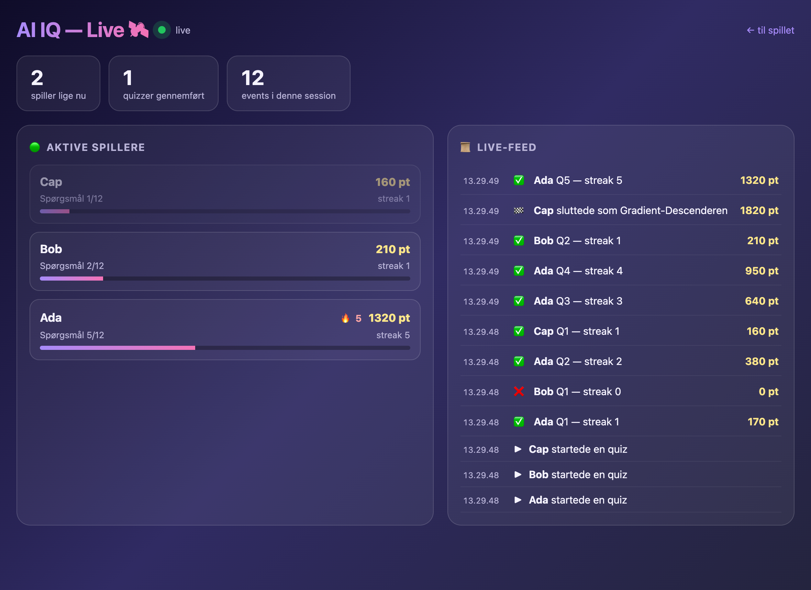

# AI IQ 🧠

En lille web-app der tester din viden om kunstig intelligens — med gamification, humor og masser af øjenguf. Bygget på [http-nu](https://github.com/cablehead/http-nu) (en Nushell-scriptbar HTTP-server) som backend.

<p align="center">
  
  
</p>

## Features

- **12 AI-spørgsmål** med jokes i både de forkerte svar og feedback-linjerne
- **Gamification**: tids-bonus, combo-multiplikator, streaks og sjove rang-titler (fra 🦜 *Stokastisk Papegøje* til 🤖 *AGI-Overherre*)
- **Øjenguf**: kortet pumper ved rigtige svar, ryster ved forkerte, og danser med en eskalerende glød på streaks
- **Stress-timer**: en nedtællingslinje der slår som et hjerte og accelererer mod nul (grøn → rød)
- **Lyd** (Web Audio, ingen lydfiler): glad blip ved rigtigt svar, womp ved forkert, tikkende ur under panik, "nah-nah-naaaaah" trombone ved timeout, og en triumf-fanfare ved perfekt score
- **Login + leaderboard**: opret en bruger, og dine bedste scores ryger på en vedvarende topliste
- **Live admin-dashboard**: følg folk spille i realtid via server-sent events
- **Tastatur-styring** (1-4 / A-D) og `prefers-reduced-motion`-support

## Login & leaderboard

<p align="center">
  
  
</p>

Et bevidst simpelt login: vælg brugernavn + kode, så huskes du via en session-cookie. Data persisteres server-side i http-nu's indbyggede **cross.stream**-store (`--store`) — ingen ekstern database. Koder gemmes som SHA-256-hash, og leaderboardet viser den bedste score pr. bruger.

API-endpoints (alle JSON):

| Metode | Sti | Funktion |
|--------|-----|----------|
| `GET`  | `/api/questions`   | Spørgsmål + rang-titler |
| `POST` | `/api/register`    | Opret bruger (sætter session-cookie) |
| `POST` | `/api/login`       | Log ind |
| `POST` | `/api/logout`      | Log ud |
| `GET`  | `/api/me`          | Hvem er logget ind |
| `POST` | `/api/score`       | Indsend score (kræver login) |
| `GET`  | `/api/leaderboard` | Top 15, bedste score pr. bruger |
| `POST` | `/api/event`       | Live-event fra en spiller (fire-and-forget) |
| `GET`  | `/api/admin/stream`| SSE-stream af alle events (kun admin) |
| `GET`  | `/admin`           | Live-dashboardet (kun admin) |

## Live admin-dashboard

<p align="center">
  
</p>

Som admin kan du følge folk spille **i realtid** på `/admin`: aktive spillere med live score/streak/progress, og et rullende live-feed. Det er drevet af http-nu's cross.stream + **server-sent events** (`.cat --follow → to sse`) — ingen polling, ingen WebSocket.

Adgang styres ved at whiteliste et brugernavn via miljøvariablen `AIIQ_ADMINS` (komma-separeret; default er `admin`). Log ind som den bruger, og `/admin` + streamen åbner sig — alle andre får `403`.

## Kør den

Kræver [http-nu](https://github.com/cablehead/http-nu) (`brew install cablehead/tap/http-nu`).

```bash
# AIIQ_ADMINS vælger hvilke(t) brugernavn(e) der kan se admin-dashboardet
AIIQ_ADMINS=ditbrugernavn http-nu :3001 --store ./store --dev -w app.nu
```

Åbn så <http://localhost:3001> i en browser.

- `--store ./store` aktiverer cross.stream-storen (brugere, sessioner, scores og events gemmes her)
- `--dev` dropper `Secure`-flaget på cookies, så login virker over `http://localhost`
- `-w` aktiverer hot-reload, så ændringer i `app.nu` slår igennem automatisk
- `AIIQ_ADMINS` — komma-separeret liste af admin-brugernavne (default `admin`)

## Struktur

- **`app.nu`** — http-nu-handler. Bruger `router`-modulet til at dispatche endpoints og serverer alt andet statisk fra `public/`. Brugere/sessioner/scores/events lever i cross.stream-topics (`users`, `sessions`, `scores`, `events`).
- **`public/index.html`** — selve quiz-appen (self-contained HTML/CSS/JS, ingen build-step).
- **`public/admin.html`** — live admin-dashboardet (lytter på SSE-streamen).

Spørgsmål og rang-titler bor som Nushell-`const` i `app.nu` og serialiseres med `to json`.

## Licens

[MIT](LICENSE) © Lennart Kiil
